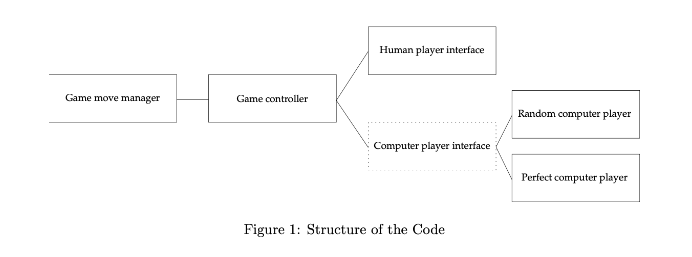

### Nim Game

We will begin our exercises with the famous Nim game. We consider here at first only the 1-heap
Nim game. These are the rules of the game:

1. There are two players who alternate in making a move. Given is a single heap of sticks. The heap contains an integer number n ∈N of sticks.
2. When it is the turn of a player, that player takes a number of sticks from the heap, either 1, 2, or 3, but never more than the remaining number of sticks in the heap.
3. After taking these sticks, it is the other player’s turn. They, again, can take 1, 2, or 3 sticks (but never more than the remaining number of sticks).
4. Then, the first player plays again, and so on. The game ends when a player leaves no sticks in the heap.
5. The player who takes the last stick or sticks, wins. Or, said otherwise, the player who first cannot make a move, loses.

You will develop a program that will permit playing the game. Centrally, this should permit a human to play against a computer, but, ultimately should support playing any type of player against any type of player (i.e. `human-vs-human`, `human-vs-computer`, `computer-vs-computer`), with any of them being able to play first.The following diagram explains the structure of the software that we are aiming for:

#### Game Controller

The game controller is the system that runs the game. It checks who are the participating players, checks who plays first, tells players what the current state of the game is (e.g. initial n, or, how many sticks are left after the other player’s move) and asks players for their move in that situation. It also stops the game when it has ended (it will never ask a player for a move when none is possible, i.e. when the game has ended) and will state the outcome of the game (who has won or lost, or if it is a draw)

#### Game Move Manager

The game controller has access to the game move manager. In the case of Nim, this is just managing how many sticks there are in the heap and how this number changes on sticks being taken away during a move, so it is quite trivial. However, in more complex games, it can be a quite considerable piece of software, and that is why we separate this from the game manager.

#### Game Controller: Player Selection

One role of the game controller is establishing who is playing. Once the players have been selected and the game has begun, from the point of view of the game controller, the players look precisely the same, whether they are human or computer players. However, before that, the game controller needs to find out who plays first and who second. Each of these could be a human, or one of the available computer players. This way, you have maximum flexibility in choosing game combinations. In a well-designed software, this can be flexibly chosen in any manner possible.

#### Players

Once the players are selected, from the point of view of the game controller, the players look
precisely the same. They get the current situation (state) of the game, and return their move. The game
controller then alternatingly selects the player whose turn it is (no matter whether human or computer)
to get their move in the given situation.

The player interface looks the same for all players: it takes a game state (in our case, completely defined
by the number n of sticks in the heap) and returns a move. A move can specify what a player is doing
(action) or what the new state is after the player has taken the action (successor state). There are
advantages in both concepts. For the purpose of the exercises, we will adopt the action model, i.e. the
players return the action they take, i.e. how many sticks they remove from the heap. In the lecture, we
will later encounter the successor state concept.

#### Computer Players

As computer player, the simplest player should be one that just returns any fixed or random legal move. Once you have mastered that, you will proceed to an optimal player; you will have to research how to model such a player. There is a simple optimal strategy for a one-heap Nim game. The interface of the player is simply a Python function that takes the current state (i.e. number of sticks) as argument and returns a move (i.e. an action, as mentioned above, that is, the number of sticks taken at the current stage).

#### Human Players

In the case of the human player, the interface should look precisely the same as for the computer player, a function that takes the current state as argument and returns the move. Inside the function, however, the program queries the human (via some input/output, e.g. a print operation) what they want to do in the given situation. In the following, we will implement these different components, beginning with the computer player.

#### Task One

Write a Python function, implementing a computer player for the 1-heap Nim game.

**Rule**: Consider a heap of n pieces. Players take alternating turns to remove 1-3 pieces. Whoever manages to take the last piece, wins.

In detail: write a function `nim(n)` that produces a legal move, i.e. it gets `n` as argument, the `number of sticks` still present on theheap, and returns `how many sticks are removed` in the current step (which needs to be a legal number of sticks).

You can assume that there is at least one stick, i.e. n > 0. This will be later ensured by the game controller.

**Hint**: You can use a random legal move. In this case, have a look at Python’s random module. Once you have completed this, you can extend the problem as follows:

1. improve `nim(n)` to `nim_best(n)` that plays optimally. You will have to research (or discuss in the practical) what the optimal move is.

2. Write a function `nim_human(n)` which asks a human (on command line or input widget) to submit a legal move and returns it.

3. Write a function that permits the human to select two players and returns them in a list — this will be used by the game controller.

4. Write a game controller that runs a game, i.e.
   - It asks the human to select a heap size;
   - It asks the human who should play and lets them select two players;
   - Permits the two players (computer or human) to play against each other, printing the progress of the game.

#### Task Two

Create a variation of the optimal nim player to address variations of the game rules:

- _nim_2_ or _nim_4_: a different number of sticks to be taken (_up to 2, or up to 4_)

- _nim_last_loses_: a different winning condition (whoever takes the last stick, loses)!

#### Task Three

Implement the Nim game using the minimax algorithm.
